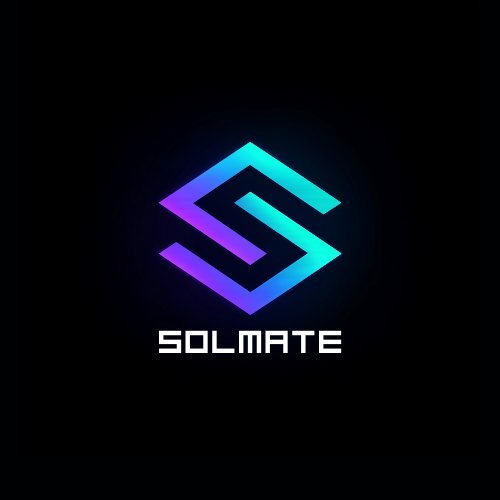

# Solmate – Solana AI Companion  🚀

<div align="center">
  
  
  [](https://vercel.com/new/clone?repository-url=https://github.com/yourusername/solmate)
  [](LICENSE)
  [](package.json)
  
  **Your chaotic-good Solana bestie with a 3D anime avatar, AI chat, voice synthesis, and live blockchain data.**
  
  [Live Demo](https://solmate-git-main-dirkdigglertowns-projects.vercel.app/) | [Report Bug](https://github.com/yourusername/solmate/issues) | [Request Feature](https://github.com/yourusername/solmate/issues)
</div>

---

## ✨ Features

- 🤖 **AI Chat** - Powered by OpenAI GPT-4o-mini with Solana-focused personality
- 🎙️ **Text-to-Speech** - Multiple voice options with browser fallback
- 👤 **3D VRM Avatar** - Anime-style character with animations and lip-sync
- 💰 **Live SOL Price** - Real-time price updates via Jupiter API
- ⚡ **Network TPS** - Solana network performance monitoring
- 🌓 **Dark/Light Theme** - Beautiful UI with glassmorphism effects
- 📱 **PWA Ready** - Installable progressive web app
- 🔒 **Secure** - Rate-limited serverless APIs with CORS protection

> ⚠️ **Disclaimer**: Not financial advice. DYOR. High volatility. Solmate cannot access wallets or execute trades.

---

## 🚀 Quick Start

### Deploy to Vercel (Recommended)

1. **Fork/Clone this repository**
   ```bash
   git clone https://github.com/yourusername/solmate.git
   cd solmate
   ```

2. **Install Vercel CLI**
   ```bash
   npm install -g vercel
   ```

3. **Set up environment variables**
   ```bash
   vercel env add OPENAI_API_KEY
   # Enter your OpenAI API key when prompted
   ```

4. **Deploy**
   ```bash
   vercel --prod
   ```

5. **Visit your deployment**
   ```
   https://your-project.vercel.app
   ```

---

## 🛠️ Technical Stack

- **Frontend**: Vanilla JavaScript, HTML5, CSS3
- **3D Graphics**: Three.js + @pixiv/three-vrm (via jsDelivr CDN)
- **Backend**: Vercel Serverless Functions (Node.js 20+)
- **APIs**: 
  - OpenAI (Chat + TTS)
  - Jupiter Lite (SOL price)
  - Helius RPC (Network stats)
- **Hosting**: Vercel Edge Network

---

## 📁 Project Structure

```
solmate/
├── web/
│   ├── index.html          # Main HTML with 3D canvas
│   ├── style.css           # Glassmorphism UI styles
│   ├── script.js           # Three.js, VRM, chat logic
│   ├── manifest.webmanifest # PWA manifest
│   ├── api/
│   │   ├── _utils.js       # CORS, rate limiting
│   │   ├── chat.js         # OpenAI chat endpoint
│   │   ├── tts.js          # Text-to-speech endpoint
│   │   ├── price.js        # Jupiter price proxy
│   │   ├── tps.js          # Network TPS endpoint
│   │   └── health.js       # Health check endpoint
│   └── assets/
│       ├── avatar/
│       │   └── solmate.vrm # 3D avatar model (21MB)
│       └── logo/
│           └── solmatelogo.png # Brand logo
├── vercel.json             # Vercel configuration
├── package.json            # Dependencies
├── LICENSE                 # MIT license
└── README.md              # This file
```

---

## 🔧 Configuration

### Environment Variables

Set these in Vercel Dashboard → Settings → Environment Variables:

| Variable | Required | Description |
|----------|----------|-------------|
| `OPENAI_API_KEY` | ✅ Yes | Your OpenAI API key for chat and TTS |
| `HELIUS_RPC_URL` | ❌ No | Custom Helius RPC endpoint (optional) |

### Getting API Keys

1. **OpenAI API Key**
   - Sign up at [platform.openai.com](https://platform.openai.com)
   - Navigate to API Keys section
   - Create a new key with appropriate permissions
   - Add usage limits to prevent unexpected charges

2. **Helius RPC (Optional)**
   - Sign up at [helius.dev](https://www.helius.dev)
   - Create a new project
   - Copy your RPC URL

---

## 💻 Local Development

### Prerequisites

- Node.js 20+ and npm 10+
- Vercel CLI
- OpenAI API key

### Setup

1. **Install dependencies**
   ```bash
   npm install
   ```

2. **Link to Vercel project**
   ```bash
   vercel link
   ```

3. **Pull environment variables**
   ```bash
   vercel env pull .env.local
   ```

4. **Start development server**
   ```bash
   npm run dev
   ```

5. **Open browser**
   ```
   http://localhost:3000
   ```

### Available Scripts

```bash
npm run dev          # Start local dev server
npm run deploy       # Deploy to production
npm run verify       # Verify deployment
npm run env:pull     # Pull env vars from Vercel
npm run clean        # Clean build artifacts
```

---

## 🎨 Customization

### Avatar Model

Replace the VRM file at `web/assets/avatar/solmate.vrm`:

1. Create/export your VRM from [VRoid Studio](https://vroid.com/studio)
2. Optimize the model:
   - Reduce polygons to ~50,000
   - Texture resolution ≤ 2048px
   - File size < 25MB
3. Name it `solmate.vrm` (lowercase)
4. Replace the existing file

### Personality

Edit the system prompt in `web/script.js`:

```javascript
const messages = [
  {
    role: 'system',
    content: `Your custom personality here...`
  },
  // ...
];
```

### UI Theme

Modify CSS variables in `web/style.css`:

```css
:root {
  --accent: #00f0ff;    /* Primary accent color */
  --accent2: #19ffa9;   /* Secondary accent */
  --bg: #0a0e17;        /* Background color */
  /* ... */
}
```

---

## 🔍 API Endpoints

### Health Check
```
GET /api/health
```
Returns system status and environment check.

### Chat
```
POST /api/chat
Content-Type: application/json

{
  "messages": [
    { "role": "user", "content": "Hello!" }
  ]
}
```

### Text-to-Speech
```
POST /api/tts
Content-Type: application/json

{
  "text": "Hello from Solmate",
  "voice": "verse"
}
```

### SOL Price
```
GET /api/price?ids=So11111111111111111111111111111111111111112
```

### Network TPS
```
GET /api/tps
```

---

## 🐛 Troubleshooting

### Avatar Not Loading

1. Check browser console for errors
2. Verify file exists: `/assets/avatar/solmate.vrm`
3. Ensure file is not Git LFS (should be regular binary)
4. Check file size is ~21MB
5. Try clearing browser cache

### No Voice/TTS

1. Verify `OPENAI_API_KEY` is set in Vercel
2. Check `/api/health` shows `env: true`
3. Ensure browser allows autoplay
4. Check OpenAI API usage/limits
5. Browser TTS will activate as fallback

### WebSocket Not Connecting

1. Check browser console for WebSocket errors
2. Verify Helius RPC key in `script.js`
3. Firewall may block WebSocket connections
4. Falls back to polling if WS fails

### Chat Not Working

1. Verify OpenAI API key is valid
2. Check API rate limits
3. Ensure CORS is properly configured
4. Check browser console for errors

### Debug Mode

Press `Ctrl+D` to toggle debug overlay showing:
- WebSocket status
- API calls
- VRM loading progress
- Error messages

---

## 🚢 Production Deployment

### Pre-deployment Checklist

- [ ] Set `OPENAI_API_KEY` in Vercel environment
- [ ] VRM file is < 25MB and not Git LFS
- [ ] Test all API endpoints locally
- [ ] Review rate limiting settings
- [ ] Check CSP headers in `index.html`
- [ ] Verify domain settings if using custom domain

### Deployment

```bash
# Deploy to production
vercel --prod

# Deploy preview
vercel

# Check deployment
npm run verify
```

### Monitoring

Monitor your deployment:
- Vercel Dashboard → Functions tab for API logs
- Vercel Dashboard → Analytics for usage
- Browser DevTools for client-side errors

---

## 🔒 Security

- **API Keys**: Never expose keys in client code
- **Rate Limiting**: 8 requests per 30s per IP
- **CORS**: Restricted to same-origin + Vercel domains
- **CSP**: Content Security Policy enforced
- **Input Sanitization**: Text limited to 500 chars
- **No Wallet Access**: Cannot execute transactions

---

## 📈 Performance

- **VRM Loading**: ~3-5s on fast connection
- **Chat Response**: ~1-2s typical
- **TTS Generation**: ~1s for short text
- **Price Updates**: Every 30 seconds
- **Bundle Size**: ~0 (all CDN loaded)
- **Lighthouse Score**: 90+ performance

---

## 🤝 Contributing

Contributions are welcome! Please feel free to submit a Pull Request.

1. Fork the repository
2. Create your feature branch (`git checkout -b feature/AmazingFeature`)
3. Commit your changes (`git commit -m 'Add some AmazingFeature'`)
4. Push to the branch (`git push origin feature/AmazingFeature`)
5. Open a Pull Request

---

## 📝 License

This project is licensed under the MIT License - see the [LICENSE](LICENSE) file for details.

---

## 🙏 Acknowledgments

- [VRoid](https://vroid.com) - VRM avatar creation
- [Three.js](https://threejs.org) - 3D graphics library
- [@pixiv/three-vrm](https://github.com/pixiv/three-vrm) - VRM loader
- [OpenAI](https://openai.com) - Chat and TTS APIs
- [Jupiter](https://jup.ag) - SOL price data
- [Helius](https://helius.dev) - Solana RPC
- [Vercel](https://vercel.com) - Hosting and serverless

---

## 📊 Status

- ✅ Core functionality complete
- ✅ Production ready
- 🚧 Advanced animations in progress
- 📋 Planned: Wallet connection (read-only)
- 📋 Planned: More avatar expressions
- 📋 Planned: Multi-language support

---

## 💬 Support

- **Issues**: [GitHub Issues](https://github.com/yourusername/solmate/issues)
- **Discussions**: [GitHub Discussions](https://github.com/yourusername/solmate/discussions)
- **Twitter**: [@yourusername](https://twitter.com/yourusername)

---

<div align="center">
  <b>Built with 💜 for the Solana community</b>
  <br>
  <sub>Remember: Not financial advice. Always DYOR!</sub>
</div>
